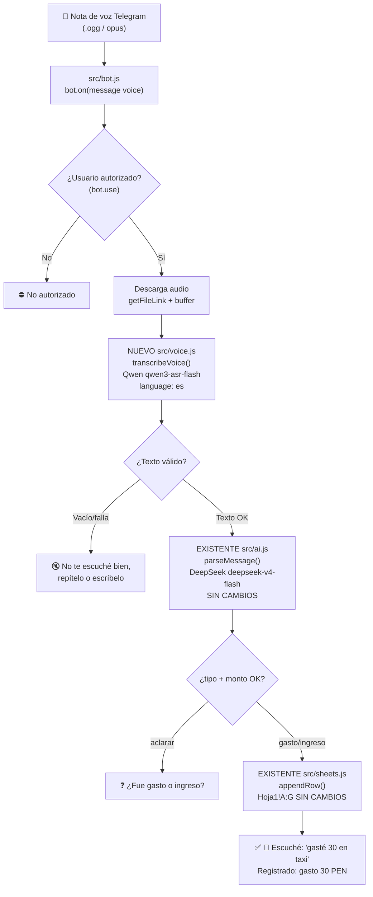

# Flujo voz bot-contable — Fase 7B

**Idea:** tu voz viaja por dos IAs en cadena — Qwen convierte voz→texto,
DeepSeek convierte texto→JSON — y de ahí en adelante todo es el código
actual sin cambios.

```text
Nota de voz (.ogg) → bot.js la descarga
  → Qwen qwen3-asr-flash (voz → "gasté 30 en taxi ayer")
  → DeepSeek parseMessage() actual (texto → JSON, SIN cambios)
  → appendRow() actual a Sheets (SIN cambios)
  → "🎤 Escuché: ... | Registrado: gasto 30 PEN..."
```

## Diagrama



Leyenda: el paso Qwen es lo único nuevo; DeepSeek y Sheets se reutilizan tal cual.
Puedes visualizarlo en <https://mermaid.live> pegando el bloque `mermaid`.
